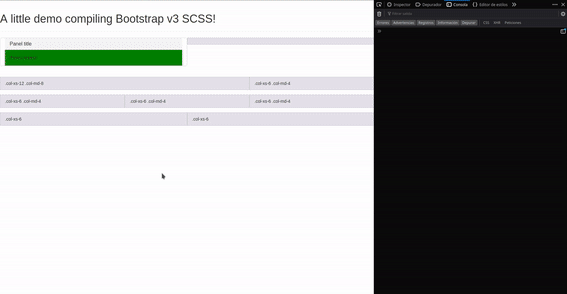
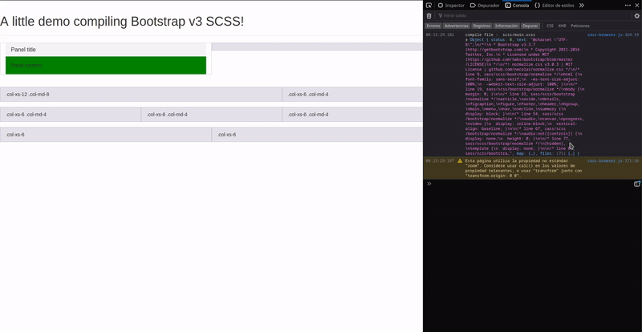

# sass-browser
[](http://doge.mit-license.org)


A tiny wrapper around [sass.js](https://github.com/medialize/sass.js/) to allow to use like less.js on browser



## Example

```html
<!-- Too simple! Simply add this to your page -->
<link rel="stylesheet/scss" type="text/scss" href="path/to/your/file.scss" />
<!-- Required to include previously sass.js -->
<script src="vendor/sass.js"></script>
<script>
// Like less.js, you can change options with a global variable. See Options
var sassOptions = { };
</script>
<script src="sass-browser.js"></script>
```

Take a look to [index.html](index.html)

## Features

* Auto Download SCSS files relative to the actual web page.
* Generates embedded sourcemaps to allow Firefox and Chrome display the original
    SCSS code from any CSS generated rule. 

## Usage

sass-browser requires to manually add sass.js to your HTML, before
sass-browser.js is included. Beyond that, like less.js in browser, would
coimple any SCSS file linked to the HTML by a tag link with
rel="stylesheet/scss". Very straightforward, not ?

### Options

sass-browser, looks for a global variable "sassOptions" where you can change a
few things of how works, adding fields to a object :

* debug (boolean) : Enables/Disables debug console output. By default it's
    disabled.
* comments (boolean) : Enables/Disables inline comments with the origin line
    and file of a generated CSS rule. By default it's enabled.
* sourceMaps (boolean) : Enables/Disables generating inline sourcemaps as data
    uri. By default it's enabled.

# FAQ

- **It's slow compared against Less.js. It's a way to speedup ?**
    - I can't do much more. I think that the problem resides on sass.js. It was
        made thinking about compiling SCSS on the browser but not to apply the
        generated styles on the web it-self. I try to improve it, doing fetchs
        on parallel. Other idea that I'm thinking, its to pre-read the SCSS and
        search @imports, and try to preload all imports, before sass.js ask for it.
        Also, I noticed that Chromium/Chrome compiles faster. In any case, this
        a tool to help to develop with SCSS where traditional node.js
        compile/watch could only be use to generate the production assets, and
        not to recompile continuously (for example a Java web application where
        some SCSS files comes from WAR dependencies)

- **What it's "stdin" on the source maps ?**
    - It's a work around over a [bug with sass.js](https://github.com/medialize/sass.js/issues/129). 
        sass-browser.js injects a tiny scss code to import yout SCSS file, 
        instead of loading to sass.js file system.
   
- **Where I can see if there is an error on my SCSS file?**
    - Look the browser javascript console. I think that the way that less.js
        shows errors, it's pretty annoying. Perhaps in a future, I would add an
        option to show a floating translucid closable div with the error information.

# License 

 [MIT License](https://opensource.org/licenses/mit-license.php)